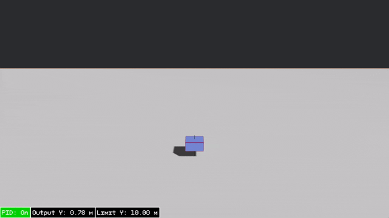

# 🚀 Drone's Altitude Control using PID Simulation

This project is a simple simulation of vertical drone control using **PID controller** written in **Rust + Bevy**. The drone attempts to maintain or reach a target altitude by controlling its thrust in real-time.

## 📐 Mathematical Model

We assume **vertical axis is Y**, and we ignore air resistance for simplicity.

**Equation of Motion**

$$
v = \frac{dy}{dt}
$$

**So,**

$$
\int_{t_0}^{t} v dt = \int_{y_0}^{y} dy
$$

$$
y(t) = y_0 + vt
$$

## 🎯 PID Controller:

$$
\text{output}(t) = K_p \cdot e(t) + K_i \cdot \int e(t) dt + K_d \cdot \frac{de(t)}{dt}
$$

Where:

| Symbol | Meaning                           |
| ------ | --------------------------------- |
| e(t)   | Error = Target - Current Altitude |
| K_p    | Proportional gain                 |
| K_i    | Integral gain                     |
| K_d    | Derivative gain                   |

## 🎲 Ziegler–Nichols Method

| Control Type | K_p     | K_i           | K_d          |
| ------------ | ------- | ------------- | ------------ |
| **P**        | 0.50K_u | —             | —            |
| **PI**       | 0.45K_u | 0.54K_u / T_u | —            |
| **PID**      | 0.60K_u | 1.2K_u / T_u  | 3K_uT_u / 40 |

## 🎮 Manual Control

You can override the system by pressing:

- `P` → Toggle PID controller on/off
- `Space` → Increase thrust (go up)
- `Left Ctrl` → Decrease thrust (go down)
- `Arrow Up` → Increase target altitude
- `Arrow Down` → Decrease target altitude
- `Esc` → Exit the simulation
