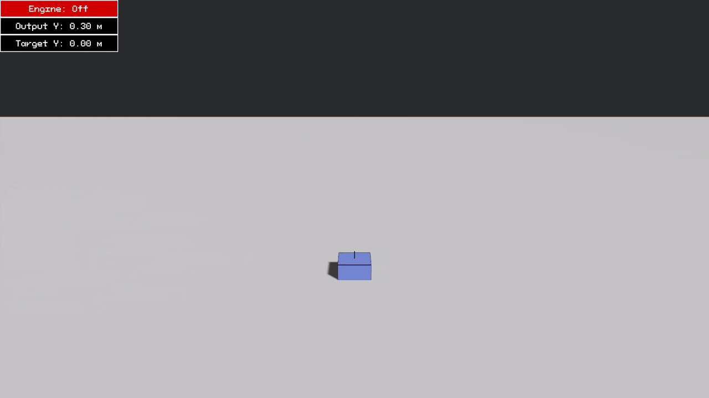

# 🚀 Drone's Altitude Control using PID Simulation

This project is a simple simulation of vertical drone control using **PID controller** written in **Rust + Bevy**. The drone attempts to maintain or reach a target altitude by controlling its thrust in real-time.

## 📐 Mathematical Model

We assume **vertical axis is Y**, and we ignore air resistance for simplicity.

**Equation of Motion**

$$
\Sigma F = m \cdot a
$$

**In y direction:**

$$
\Sigma F_y = T - m \cdot g = m \cdot a
$$

$$
T = m \cdot (g + a)
$$

## 🎯 PID Controller:

$$
\text{output}(t) = K_p \cdot e(t) + K_i \cdot \int e(t) dt + K_d \cdot \frac{de(t)}{dt}
$$

Where:

| Symbol | Meaning                           |
| ------ | --------------------------------- |
| e(t)   | Error = Target - Current Altitude |
| K_p    | Proportional gain                 |
| K_i    | Integral gain                     |
| K_d    | Derivative gain                   |

## 🎲 Ziegler–Nichols Method

| Control Type | K_p     | K_i           | K_d          |
| ------------ | ------- | ------------- | ------------ |
| **P**        | 0.50K_u | —             | —            |
| **PI**       | 0.45K_u | 0.54K_u / T_u | —            |
| **PID**      | 0.60K_u | 1.2K_u / T_u  | 3K_uT_u / 40 |

## 🎮 Manual Control

You can override the system by pressing:

- `P` → Toggle Start Engine on/off
- `Space` → Increase Altitude (go up)
- `Left Ctrl` → Decrease Altitude (go down)
- `W` → Pitch Down (tilt forward)
- `S` → Pitch Up (tilt backward)
- `A` → Roll Left (tilt left)
- `D` → Roll Right (tilt right)
- `Q` → Yaw Left (rotate left)
- `E` → Yaw Right (rotate right)
- `R` → Reset Target Altitude to 0 (Only works when engine is off)
- `Esc` → Exit the simulation
